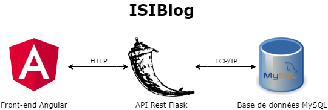

# TP d'intégration d'application : ISIBlog

Contributeurs :
- William Garrier
- Paul-Emeric Saunier
- Mairtin Marjollet

    

---

## Consignes d'installation

### 1. Front-end

1. Installer Node.js et ouvrir le command prompt Node  
   Installer Angular CLI avec la commande suivante : `npm install -g @angular/cli`

2. Aller dans le dossier ISIBlog avec le command prompt Node

3. Exécuter la commande suivante : `ng serve --open`

4. Le front-end Angular se lance sur le port 4200 : [http://localhost:4200](http://localhost:4200)

### 2. Base de données

1. Installer une base de données MySQL

2. Se connecter en root et exécuter le script suivant : ``Database/create_db.sql`

3. Créer un utilisateur :  
   > Nom d'utilisateur : `isiblog`  
   > Mot de passe : `isiblog`  
   > Lui accorder les accès de lecture et écriture sur le schéma `dbisiblog`  

4. La base MySQL devrai alors contenir un schéma `dbisiblog` contenant une table `comments` avec quelques lignes

### 3. API Rest

1. Installer python

2. Dans le dossier racine du projet créer un environnement virtuel python avec la commande suivante :  
   `python -m venv pyenv`

3. Activer l'environnement avec la commande suivante :  
   `.\pyenv\Scripts\activate`

4. Installer les dépendances nécessaires à l'api :  
   > `pip install flask`  
   > `pip install flask-cors`  
   > `pip install apispec`  
   > `pip install marshmallow`  
   > `pip install flask_swagger_ui`  
   > `pip install mysql-connector-python`

5. Lancer l'API Rest avec la commande suivante :  
   `python RestAPI\rest_api.py`  
   **Attention : La base de données doit être lancée avant l'API Rest**

6. Si vous avez effectué correctement les étapes, des données devraient être affichées sur le front-end

---

## Liste des ressources

Technologies :
> Angular (Typescript)  
> Flask (Python)  
> MySQL (SQL)

Ports :
> Front-end Angular : 4200  
> Back-end Flask : 5000  
> Base de données MySQL : 3306

URL :
> Front-end Angular : [http://localhost:4200](http://localhost:4200)  
> Swagger Back-end Flask : [http://localhost:5000/docs](http://localhost:5000/docs)